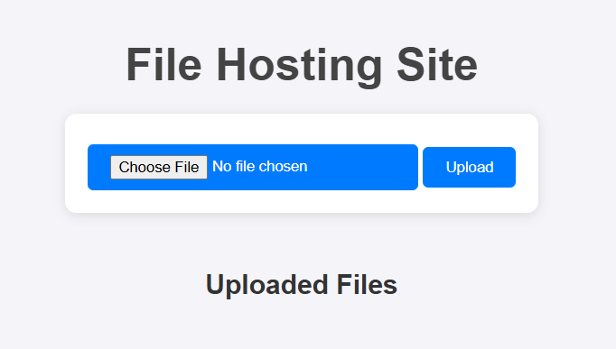

# File Hosting Site

A simple and elegant file hosting web application built with Flask that allows users to upload and download files through a web interface. Perfect for sharing files between devices without the need for physical storage devices like pen drives.

## Features

- 📤 **File Upload**: Easy drag-and-drop or click-to-select file uploading
- 📥 **File Download**: Direct download links for all uploaded files
- 🎨 **Clean UI**: Modern, responsive design with hover effects
- 📱 **Mobile Friendly**: Works seamlessly on desktop and mobile devices
- 🔒 **Simple Setup**: No complex configuration required

## Screenshots


The application features a clean, modern interface with:
- Centered layout with soft shadows
- Blue color scheme with hover animations
- File upload form with styled buttons
- List of uploaded files with download links

## Installation

1. **Clone or download the project**
   ```bash
   cd "Server projects/Files hosting site"
   ```

2. **Install required dependencies**
   ```bash
   pip install flask
   ```

3. **Run the application**
   ```bash
   python app.py
   ```

4. **Access the application**
   Open your web browser and navigate to `http://localhost:5000`

## Project Structure

```
Files hosting site/
├── app.py                 # Main Flask application
├── README.md             # Project documentation
├── uploaded-files/       # Directory for uploaded files (auto-created)
├── templates/
│   └── index.html        # Main page template
└── static/
    └── css/
        └── styles.css    # Styling for the application
```

## Usage

### Uploading Files
1. Open the application in your web browser
2. Click "Choose File" or drag and drop a file
3. Click "Upload" to upload the file
4. The file will appear in the "Uploaded Files" list

### Downloading Files
1. Click on any file name in the "Uploaded Files" list
2. The file will be downloaded to your device

## Technical Details

- **Framework**: Flask (Python web framework)
- **Frontend**: HTML5, CSS3 with modern styling
- **File Storage**: Local filesystem in `uploaded-files/` directory
- **File Handling**: Secure file upload and download with Flask's built-in functions

## Configuration

The application uses the following default settings:
- **Upload Folder**: `uploaded-files/`
- **Debug Mode**: Enabled (for development)
- **Host**: `localhost` (127.0.0.1)
- **Port**: `5000`

To modify these settings, edit the relevant sections in [`app.py`](app.py).

## Security Considerations

⚠️ **Important**: This is a basic file hosting application intended for local or trusted network use. For production deployment, consider implementing:

- File type restrictions
- File size limits
- User authentication
- HTTPS encryption
- Input validation and sanitization

## Contributing

This project is part of a larger workspace with multiple Flask applications. Feel free to:
- Report bugs or issues
- Suggest new features
- Submit pull requests

## License

This project is for educational and personal use. Modify and distribute as needed. Visit [license.txt](LICENSE.txt) for more details.

---

**Note**: This application is designed for people who prefer web-based file sharing over traditional storage methods like pen drives.